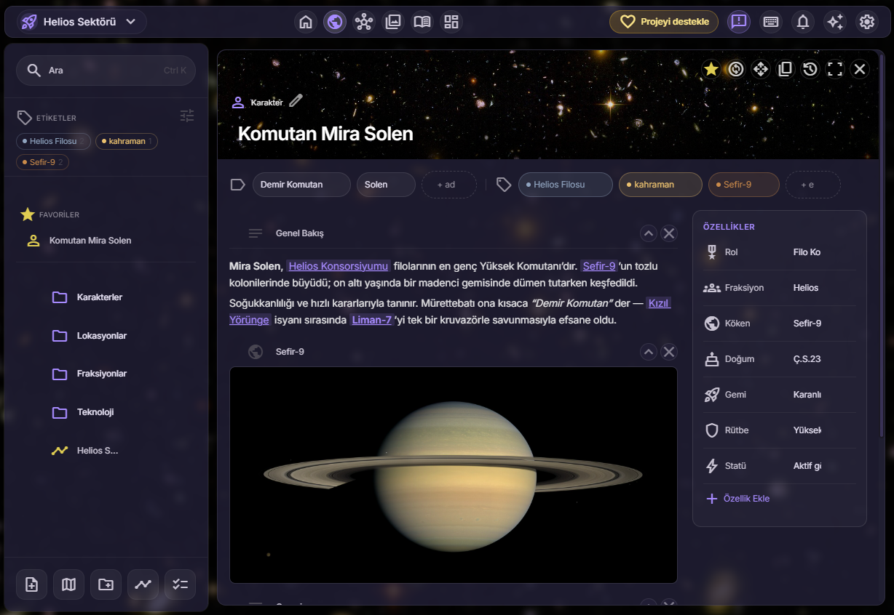

# Aura World

**Kendi evrenini kur** — karakterler, mekanlar, tarih ve haritalarla.
Tamamen **yerel** ve **çevrimdışı** çalışan bir dünya kurma (worldbuilding) uygulaması.

*Build your own universe — a fully local, offline worldbuilding desktop app.*

&nbsp;

&nbsp;

---

## ✨ Aura World nedir?

Aura World; roman, oyun, RPG ya da sadece hayal gücün için kurduğun evrenleri tek bir yerde toplayan bir masaüstü uygulamasıdır. Her şey birbirine bağlı, her şey senin kontrolünde — ve **hiçbir verin internete gitmez**, yalnızca kendi bilgisayarında durur.

## 🌌 Özellikler

- **🗂️ Kartlar** — Karakter, mekan, eşya, topluluk… Her şey bir kart. Özellikler ekle, zengin metin yaz, kapak görseli koy.
- **🕸️ İlişki grafiği** — Kartları birbirine bağla; aile ağaçları ve ittifaklar interaktif bir ağ olarak karşına çıksın.
- **🕰️ Zaman çizelgesi** — Çağları ve olayları kendi özel takviminle diz.
- **🗺️ Haritalar** — Kendi haritalarını yükle, pinler ve bölgeler çiz, kartları konumlarına bağla.
- **🎨 Temalar & Arşiv** — Türüne göre hazır temalar, görsel arşivi, tek renkle tüm arayüzü saran tasarım.
- **🤖 Yapay zeka (beta)** — İstersen kendi API anahtarınla birlikte yaz; fikir üret, metinleri genişlet.
- **📖 Corebook PDF** — Evrenini şık bir PDF kitap olarak dışa aktar.
- **🔒 Gizlilik** — Sunucu yok, hesap yok, takip yok. Otomatik yerel yedekleme + sürüm geçmişi.
- **🌍 Türkçe & İngilizce** arayüz.

## ⬇️ İndir

En güncel sürümü **[İndirme sayfasından](https://kaoss7r9er.github.io/aura-world/download.html)** ya da **[Releases](../../releases/latest)** bölümünden alabilirsin.

> Şu an **Windows** için hazır. macOS ve Linux sürümleri üzerinde çalışılıyor.

**Kurulum:** İndirdiğin `Aura-World-Setup-*.exe` dosyasını çalıştır. Windows “bilinmeyen yayıncı” uyarısı verirse *Daha fazla bilgi → Yine de çalıştır* de (uygulama imzasız olduğu için normaldir).

## 💛 Destek ol

Aura World tek kişinin emeğiyle, ücretsiz geliştiriliyor. İstersen **[bağış sayfasından](https://kaoss7r9er.github.io/aura-world/donate.html)** (Kreosus, IBAN, Papara) küçük bir destek olabilirsin — tamamen gönüllü. 🤍

## 📄 Lisans

Aura World, **[PolyForm Noncommercial License 1.0.0](LICENSE.md)** ile sunulur:
kurabilir, kullanabilir ve değiştirebilirsin; **ticari kullanım yasaktır**.

## 📬 İletişim

Soru, öneri ve geri bildirim: **auraworld.app@outlook.com**

© 2026 Taha Karaoğlu · Aura World

